# 🏗️ ScoopSocials Platform - Complete Data Flow Architecture

## 📊 **SYSTEM OVERVIEW**

```
┌─────────────────┐    ┌─────────────────┐    ┌─────────────────┐
│   FRONTEND      │    │   BACKEND API   │    │   DATABASE      │
│   (Next.js)     │◄──►│   (Express.js)  │◄──►│   (PostgreSQL)  │
└─────────────────┘    └─────────────────┘    └─────────────────┘
         │                       │                       │
         ▼                       ▼                       ▼
┌─────────────────┐    ┌─────────────────┐    ┌─────────────────┐
│   CACHE LAYER   │    │   WORKER QUEUE  │    │   REDIS CACHE   │
│   (In-Memory)   │    │   (Trust Score) │    │   (Valkey)      │
└─────────────────┘    └─────────────────┘    └─────────────────┘
```

---

## 🔄 **AUTHENTICATION FLOW**

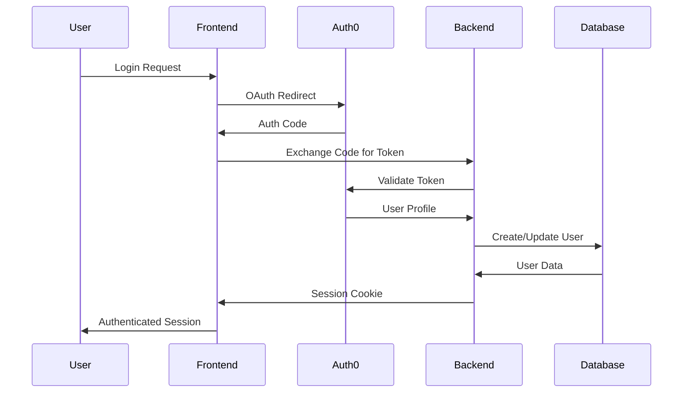

### **Data Flow Details:**
1. **User Login** → Auth0 OAuth flow
2. **Token Exchange** → Backend validates with Auth0
3. **User Sync** → Backend creates/updates user in PostgreSQL
4. **Session Creation** → Frontend stores session cookie
5. **API Calls** → Include session cookie for authentication

---

## 👥 **USER MANAGEMENT FLOW**

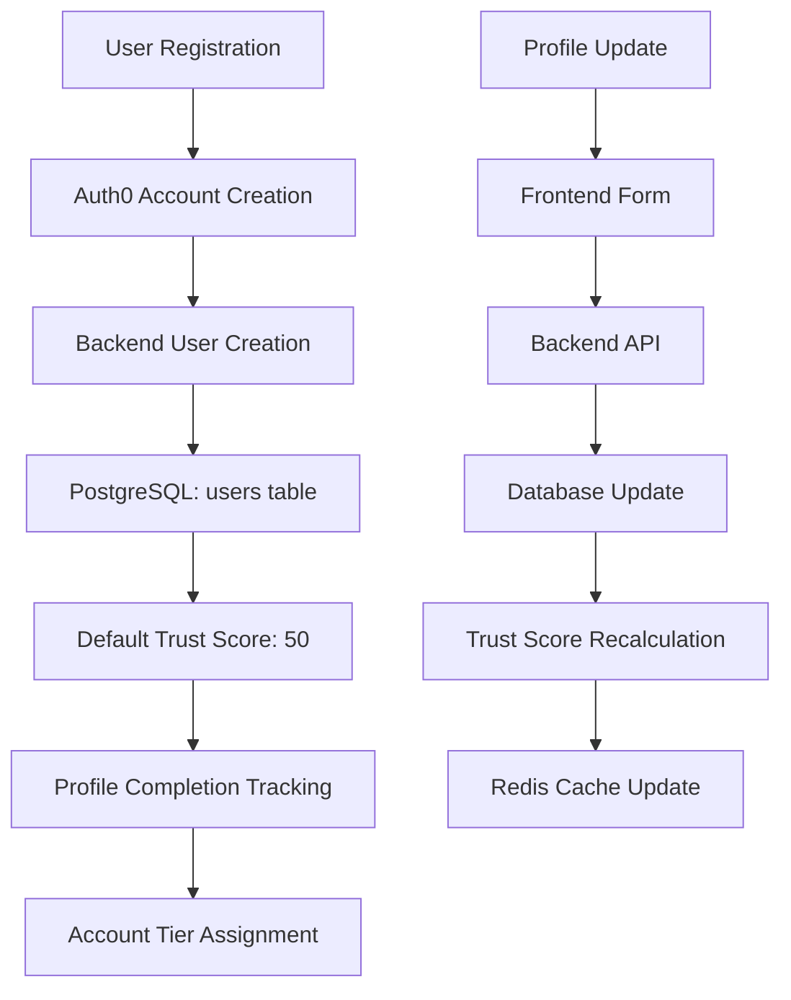

### **Database Schema:**
```sql
-- Users Table
CREATE TABLE users (
  id SERIAL PRIMARY KEY,
  auth_id VARCHAR(255) UNIQUE NOT NULL,  -- Auth0 ID
  name VARCHAR(255) NOT NULL,
  username VARCHAR(100) UNIQUE,
  email VARCHAR(255) UNIQUE,
  phone VARCHAR(50),
  avatar_url TEXT,
  bio TEXT,
  location VARCHAR(255),
  website VARCHAR(255),
  birth_date DATE,
  gender VARCHAR(50),
  occupation VARCHAR(255),
  company VARCHAR(255),
  interests JSONB DEFAULT '[]',
  trust_score INTEGER DEFAULT 50,
  account_tier VARCHAR(50) DEFAULT 'basic',
  profile_completion INTEGER DEFAULT 0,
  created_at TIMESTAMP DEFAULT CURRENT_TIMESTAMP,
  updated_at TIMESTAMP DEFAULT CURRENT_TIMESTAMP
);
```

---

## 🏆 **TRUST SCORE SYSTEM FLOW**

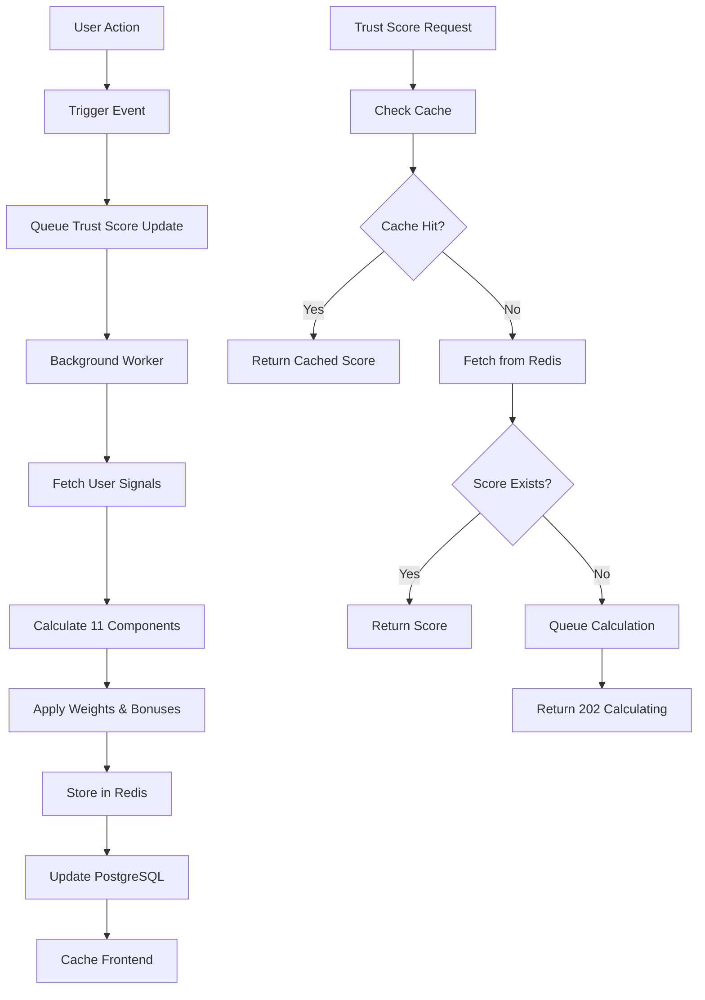

### **Trust Score Components:**
1. **Account Age** (12%) - Account longevity
2. **Profile Completion** (12%) - Profile completeness
3. **Events Participation** (18%) - Event attendance/hosting
4. **Community Activity** (10%) - Posts, comments
5. **Social Engagement** (8%) - Friends, interactions
6. **Reviews Ratings** (7%) - Quality of reviews
7. **Content Quality** (6%) - Content upvotes/downvotes
8. **Platform Contribution** (5%) - Reports, feedback
9. **Connected Accounts** (8%) - Social media verifications
10. **Positive Interactions** (6%) - Helpful votes
11. **Flagging Accuracy** (5%) - Content flagging accuracy

### **Calculation Process:**
```javascript
// 1. Fetch User Signals
const signals = await fetchUserSignals(userId)

// 2. Calculate Component Scores
const components = {
  accountAge: (signals.accountAgeInDays / 365) * 40 + 10,
  profileCompletion: completedFields / totalFields * 100,
  eventsParticipation: (attended * 3 + hosted * 8) * reliability,
  // ... other components
}

// 3. Apply Weights
const weightedScore = Object.entries(components)
  .reduce((sum, [key, score]) => sum + (score * weights[key]), 0)

// 4. Store Results
await redis.set(`trust:score:${userId}`, JSON.stringify({
  score: weightedScore,
  details: components,
  computed_at: new Date().toISOString()
}))
```

---

## 📅 **EVENTS SYSTEM FLOW**

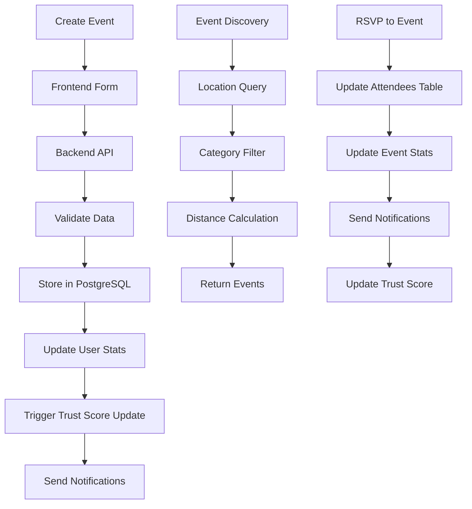

### **Events Database Schema:**
```sql
-- Events Table
CREATE TABLE events (
  id SERIAL PRIMARY KEY,
  creator_id INTEGER REFERENCES users(id),
  title VARCHAR(255) NOT NULL,
  description TEXT,
  category VARCHAR(100) NOT NULL,
  start_date TIMESTAMP NOT NULL,
  end_date TIMESTAMP,
  location_name VARCHAR(255),
  coordinates POINT,
  max_attendees INTEGER,
  price DECIMAL(10,2) DEFAULT 0,
  is_public BOOLEAN DEFAULT true,
  tags JSONB DEFAULT '[]',
  photos JSONB DEFAULT '[]',
  created_at TIMESTAMP DEFAULT CURRENT_TIMESTAMP,
  updated_at TIMESTAMP DEFAULT CURRENT_TIMESTAMP
);

-- Event Attendees
CREATE TABLE event_attendees (
  id SERIAL PRIMARY KEY,
  event_id INTEGER REFERENCES events(id),
  user_id INTEGER REFERENCES users(id),
  status VARCHAR(20) DEFAULT 'attending',
  rsvp_date TIMESTAMP DEFAULT CURRENT_TIMESTAMP,
  UNIQUE(event_id, user_id)
);
```

---

## 👥 **SOCIAL CONNECTIONS FLOW**

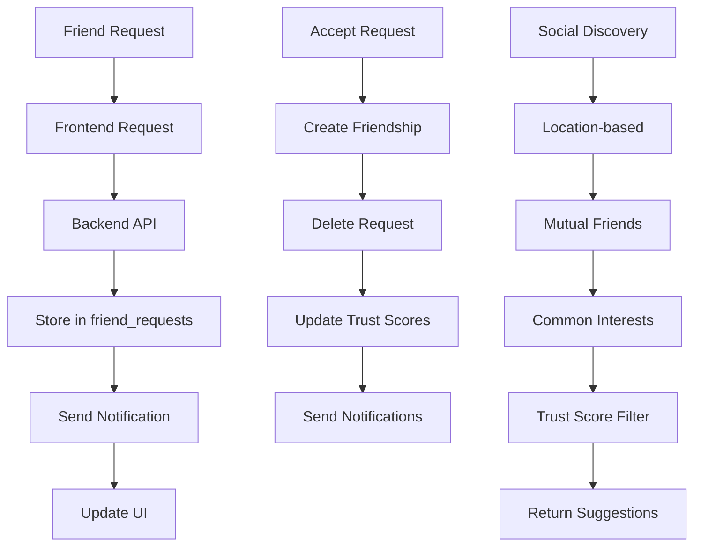

### **Social Database Schema:**
```sql
-- Friendships
CREATE TABLE friendships (
  id SERIAL PRIMARY KEY,
  user_id_1 INTEGER REFERENCES users(id),
  user_id_2 INTEGER REFERENCES users(id),
  status VARCHAR(20) DEFAULT 'accepted',
  created_at TIMESTAMP DEFAULT CURRENT_TIMESTAMP,
  UNIQUE(user_id_1, user_id_2),
  CHECK (user_id_1 < user_id_2)
);

-- Friend Requests
CREATE TABLE friend_requests (
  id SERIAL PRIMARY KEY,
  from_user_id INTEGER REFERENCES users(id),
  to_user_id INTEGER REFERENCES users(id),
  status VARCHAR(20) DEFAULT 'pending',
  message TEXT,
  created_at TIMESTAMP DEFAULT CURRENT_TIMESTAMP,
  UNIQUE(from_user_id, to_user_id)
);
```

---

## 📝 **CONTENT & POSTS FLOW**

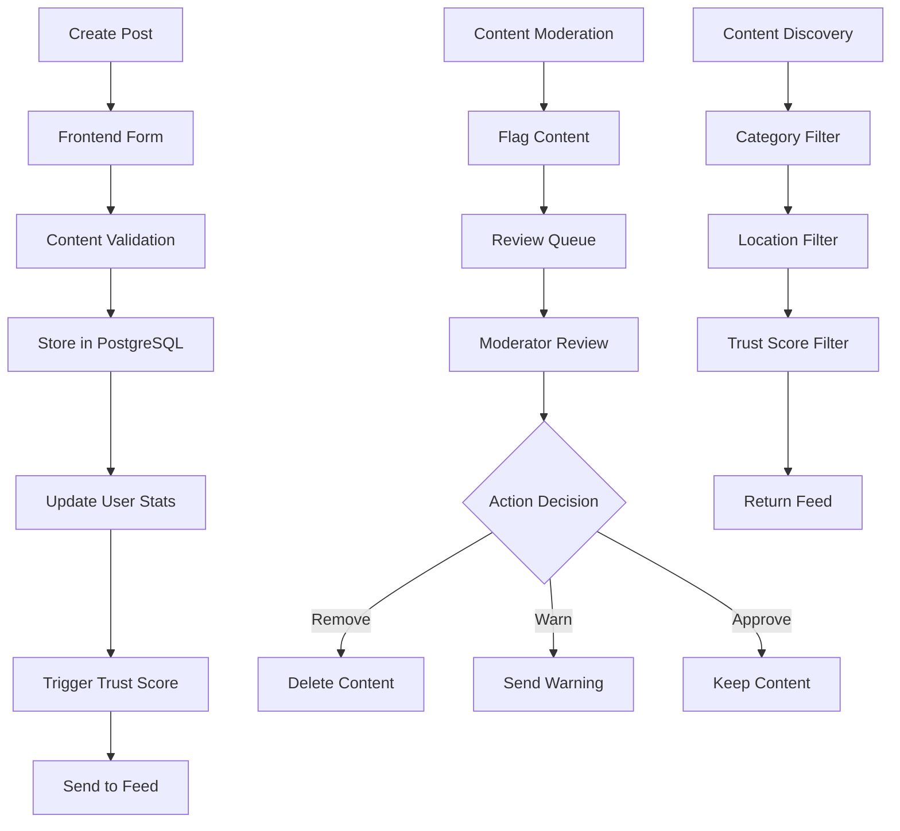

### **Posts Database Schema:**
```sql
-- Posts Table
CREATE TABLE posts (
  id SERIAL PRIMARY KEY,
  author_id INTEGER REFERENCES users(id),
  review_for_id INTEGER REFERENCES users(id),
  category VARCHAR(100) NOT NULL,
  content TEXT NOT NULL,
  tags JSONB DEFAULT '[]',
  is_public BOOLEAN DEFAULT true,
  coordinates POINT,
  location_name VARCHAR(255),
  photos JSONB DEFAULT '[]',
  likes_count INTEGER DEFAULT 0,
  comments_count INTEGER DEFAULT 0,
  created_at TIMESTAMP DEFAULT CURRENT_TIMESTAMP,
  updated_at TIMESTAMP DEFAULT CURRENT_TIMESTAMP
);
```

---

## 🔔 **NOTIFICATIONS FLOW**

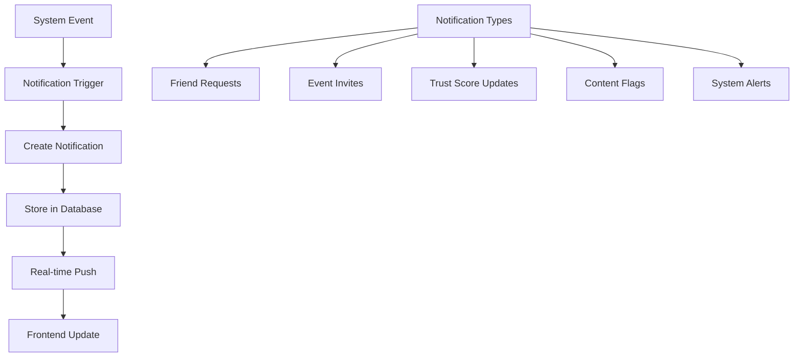

### **Notifications Database Schema:**
```sql
-- Notifications Table
CREATE TABLE notifications (
  id SERIAL PRIMARY KEY,
  to_user_id INTEGER REFERENCES users(id),
  from_user_id INTEGER REFERENCES users(id),
  type VARCHAR(50) NOT NULL,
  title VARCHAR(255) NOT NULL,
  message TEXT,
  event_id INTEGER REFERENCES events(id),
  read BOOLEAN DEFAULT false,
  metadata JSONB DEFAULT '{}',
  created_at TIMESTAMP DEFAULT CURRENT_TIMESTAMP
);
```

---

## 🔗 **SOCIAL MEDIA INTEGRATION FLOW**

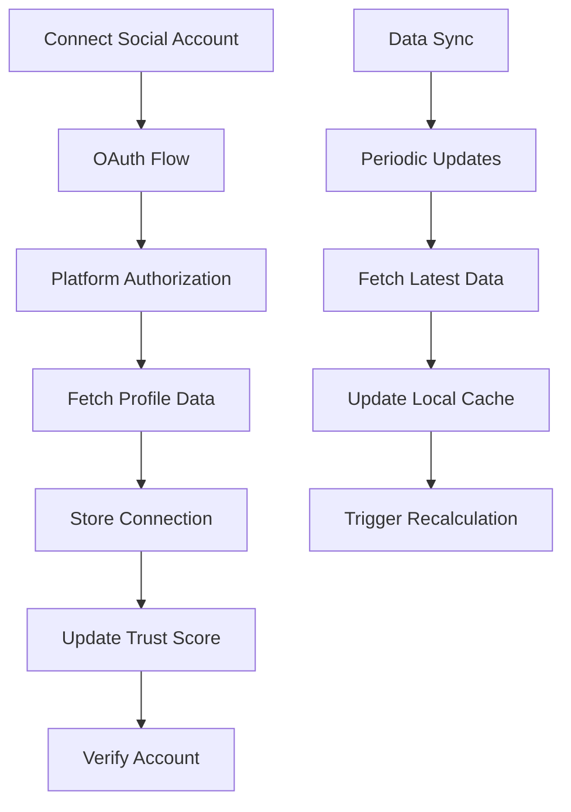

### **Connected Accounts Schema:**
```sql
-- Connected Accounts
CREATE TABLE connected_accounts (
  id SERIAL PRIMARY KEY,
  user_id INTEGER REFERENCES users(id),
  platform VARCHAR(100) NOT NULL,
  platform_user_id VARCHAR(255),
  username VARCHAR(255),
  is_verified BOOLEAN DEFAULT false,
  followers_count INTEGER DEFAULT 0,
  account_data JSONB,
  connected_at TIMESTAMP DEFAULT CURRENT_TIMESTAMP,
  UNIQUE(user_id, platform)
);
```

---

## 🗄️ **CACHING STRATEGY**

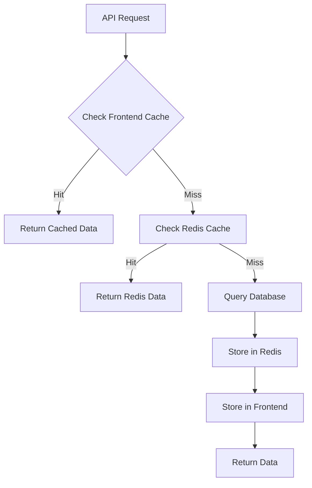

### **Cache TTL Strategy:**
- **User Profiles**: 1 hour
- **Trust Scores**: 5 minutes (active users)
- **Event Lists**: 10 minutes
- **Friend Lists**: 30 minutes
- **Search Results**: 15 minutes
- **Notifications**: 5 minutes

---

## 🔄 **DATA PERSISTENCE & BACKUP**

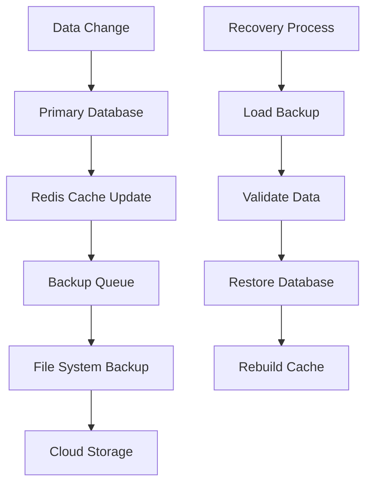

### **Backup Strategy:**
1. **Real-time**: Redis persistence
2. **Hourly**: Database snapshots
3. **Daily**: Full system backup
4. **Weekly**: Cloud storage backup

---

## 📊 **MONITORING & ANALYTICS**

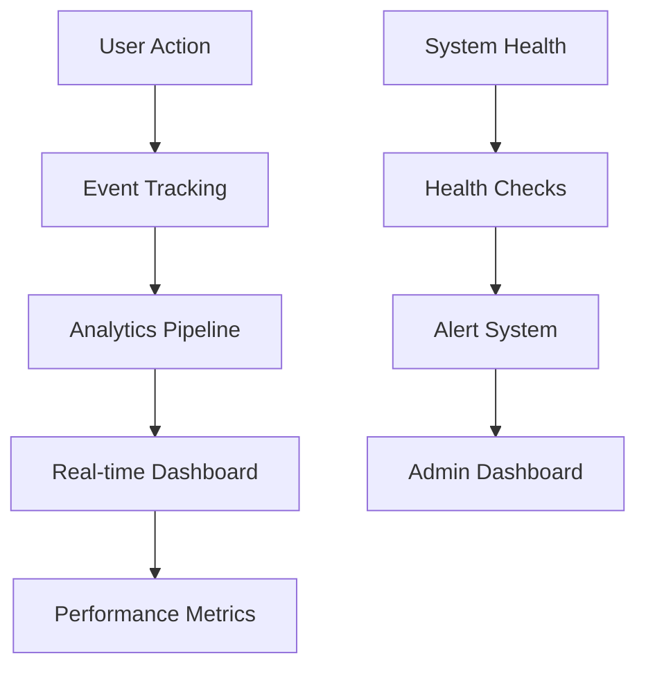

### **Key Metrics:**
- **API Response Times**
- **Trust Score Calculation Times**
- **Cache Hit Rates**
- **Database Query Performance**
- **User Engagement Metrics**
- **Error Rates**

---

## 🚀 **DEPLOYMENT ARCHITECTURE**

```
┌─────────────────────────────────────────────────────────────┐
│                    PRODUCTION ENVIRONMENT                   │
├─────────────────────────────────────────────────────────────┤
│  Frontend (DigitalOcean App Platform)                      │
│  ├── Next.js Application                                   │
│  ├── Static Assets (CDN)                                   │
│  └── Service Worker (PWA)                                  │
├─────────────────────────────────────────────────────────────┤
│  Backend (DigitalOcean Droplet)                            │
│  ├── Express.js API Server                                 │
│  ├── Trust Score Worker                                    │
│  ├── PostgreSQL Database                                   │
│  └── Redis Cache (Valkey)                                  │
├─────────────────────────────────────────────────────────────┤
│  External Services                                         │
│  ├── Auth0 (Authentication)                                │
│  ├── Mapbox (Maps)                                         │
│  ├── Social Media APIs                                     │
│  └── Monitoring Services                                   │
└─────────────────────────────────────────────────────────────┘
```

---

## 🔧 **API ENDPOINTS OVERVIEW**

### **Authentication:**
- `POST /api/auth/login` - User login
- `POST /api/auth/signup` - User registration
- `GET /api/auth/status` - Check auth status

### **Users:**
- `GET /api/user` - Get current user
- `PUT /api/profile/update` - Update profile
- `GET /api/user/[id]` - Get user by ID

### **Events:**
- `GET /api/events` - List events
- `POST /api/events` - Create event
- `GET /api/events/[id]` - Get event details
- `POST /api/events/[id]/rsvp` - RSVP to event

### **Social:**
- `GET /api/friends` - Get friends list
- `POST /api/friends/request` - Send friend request
- `PUT /api/friends/accept` - Accept friend request

### **Trust Score:**
- `GET /api/trust-score` - Get trust score
- `POST /api/trust-score/revalidate` - Recalculate score

### **Content:**
- `GET /api/posts` - Get posts
- `POST /api/posts` - Create post
- `POST /api/flag` - Flag content

---

## 📈 **PERFORMANCE OPTIMIZATIONS**

### **Frontend:**
- **Code Splitting**: Route-based lazy loading
- **Image Optimization**: WebP/AVIF formats
- **Service Worker**: Offline caching
- **Bundle Optimization**: Tree shaking

### **Backend:**
- **Connection Pooling**: PostgreSQL connections
- **Query Optimization**: Indexed queries
- **Background Processing**: Worker queues
- **Caching Strategy**: Multi-layer caching

### **Database:**
- **Indexes**: Optimized for common queries
- **Partitioning**: Large tables partitioned
- **Read Replicas**: Analytics queries
- **Backup Strategy**: Automated backups

---

## 🔒 **SECURITY MEASURES**

### **Authentication:**
- **OAuth 2.0**: Auth0 integration
- **JWT Tokens**: Secure session management
- **Rate Limiting**: API protection
- **CORS**: Cross-origin restrictions

### **Data Protection:**
- **HTTPS**: All communications encrypted
- **Input Validation**: SQL injection prevention
- **Content Security Policy**: XSS protection
- **Data Encryption**: Sensitive data encrypted

### **Privacy:**
- **GDPR Compliance**: User consent management
- **Data Minimization**: Only necessary data stored
- **User Controls**: Privacy settings
- **Audit Logging**: Data access tracking

---

This architecture ensures a scalable, secure, and performant platform that can handle the complex social interactions and trust scoring requirements of ScoopSocials.
