# 🏗️ ScoopSocials Platform - Flow Charts & Swim Lane Diagrams

## 📊 **SYSTEM ARCHITECTURE OVERVIEW**

```mermaid
graph TB
    subgraph "FRONTEND LAYER"
        A[Next.js App]
        B[React Components]
        C[Service Worker]
        D[Local Cache]
    end
    
    subgraph "API GATEWAY"
        E[Next.js API Routes]
        F[Authentication Middleware]
        G[Rate Limiting]
    end
    
    subgraph "BACKEND SERVICES"
        H[Express.js Server]
        I[Trust Score Worker]
        J[Background Jobs]
    end
    
    subgraph "DATA LAYER"
        K[PostgreSQL Database]
        L[Redis Cache (Valkey)]
        M[File Storage]
    end
    
    subgraph "EXTERNAL SERVICES"
        N[Auth0]
        O[Mapbox]
        P[Social Media APIs]
    end
    
    A --> E
    B --> E
    C --> E
    E --> H
    E --> N
    H --> K
    H --> L
    H --> I
    I --> L
    I --> K
    H --> O
    H --> P
    D --> A
```

---

## 🔄 **AUTHENTICATION SWIM LANE DIAGRAM**

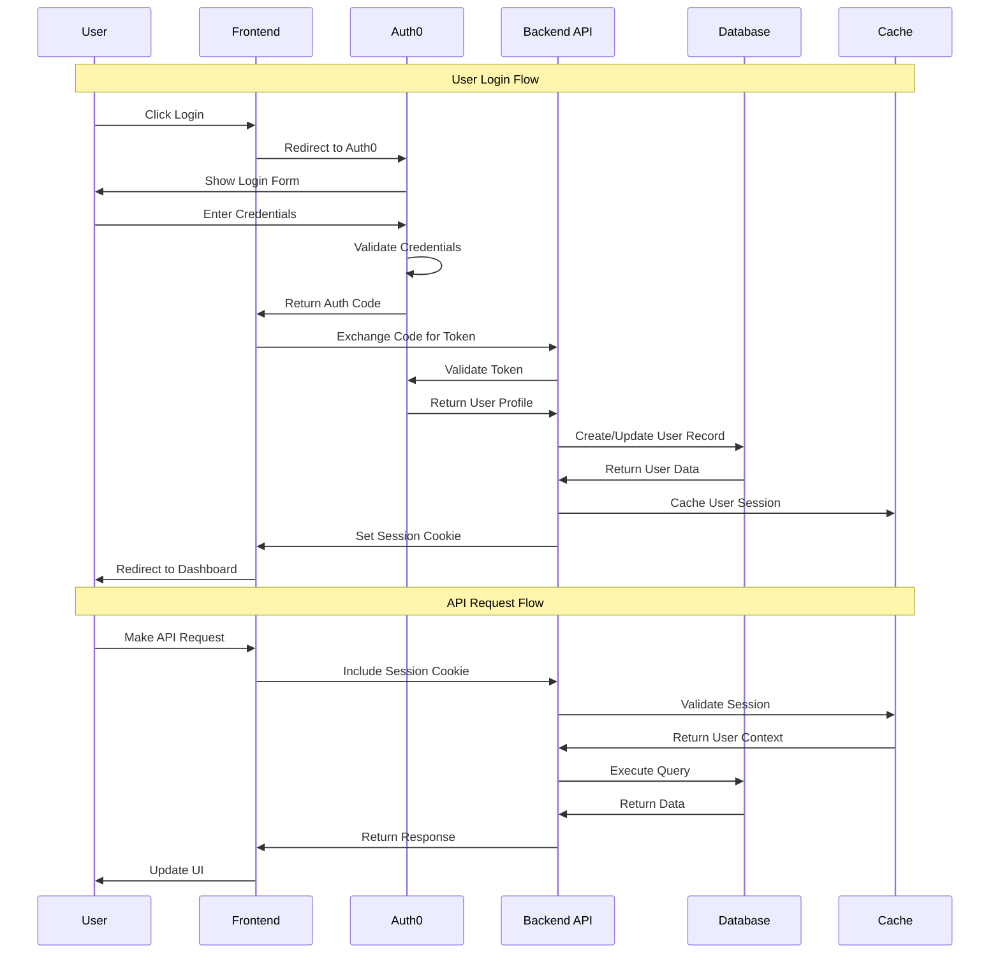

---

## 👥 **USER REGISTRATION FLOW CHART**

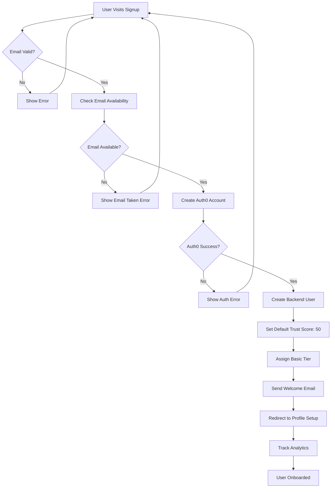

---

## 🏆 **TRUST SCORE CALCULATION SWIM LANE**

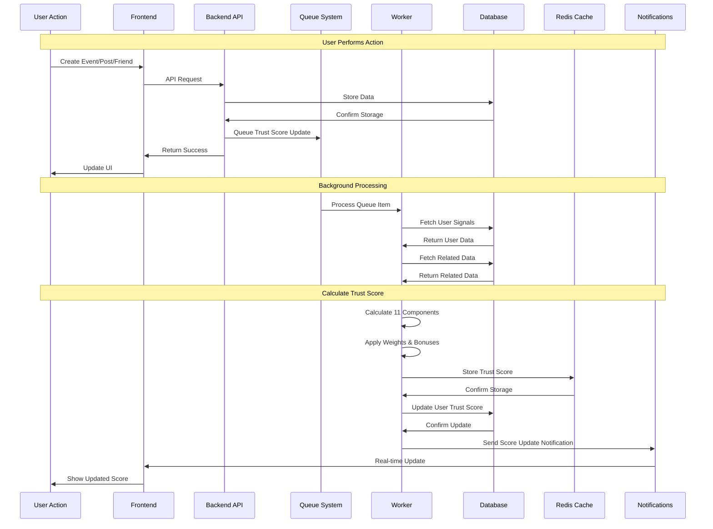

---

## 📅 **EVENT CREATION FLOW CHART**

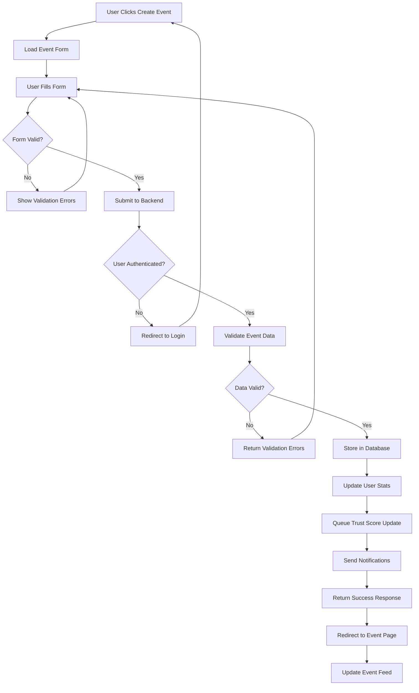

---

## 👥 **FRIEND REQUEST SWIM LANE DIAGRAM**

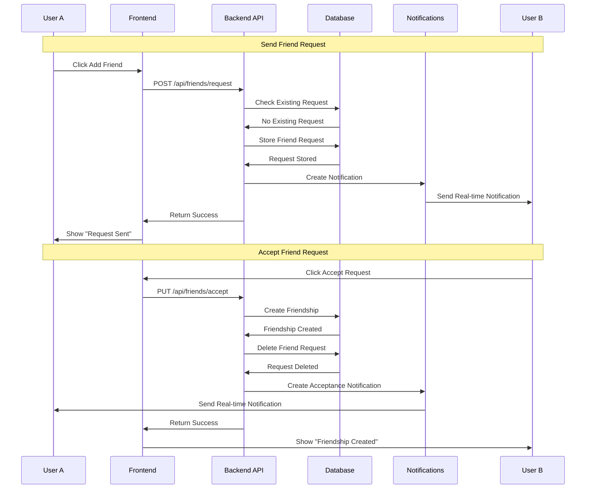

---

## 📝 **CONTENT MODERATION FLOW CHART**

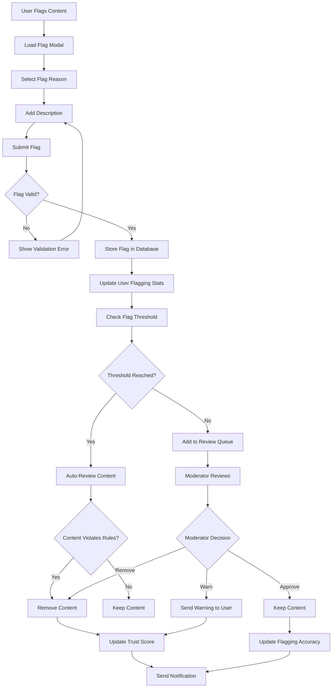

---

## 🔔 **NOTIFICATION SYSTEM SWIM LANE**

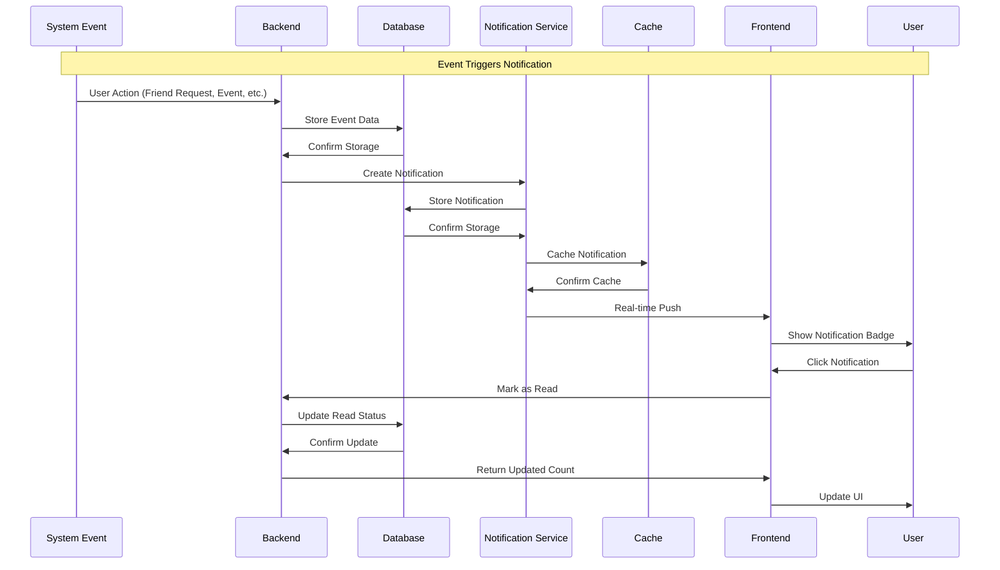

---

## 🔗 **SOCIAL MEDIA INTEGRATION FLOW CHART**

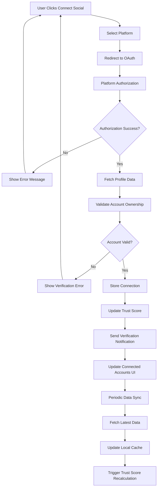

---

## 🗄️ **CACHING STRATEGY SWIM LANE**

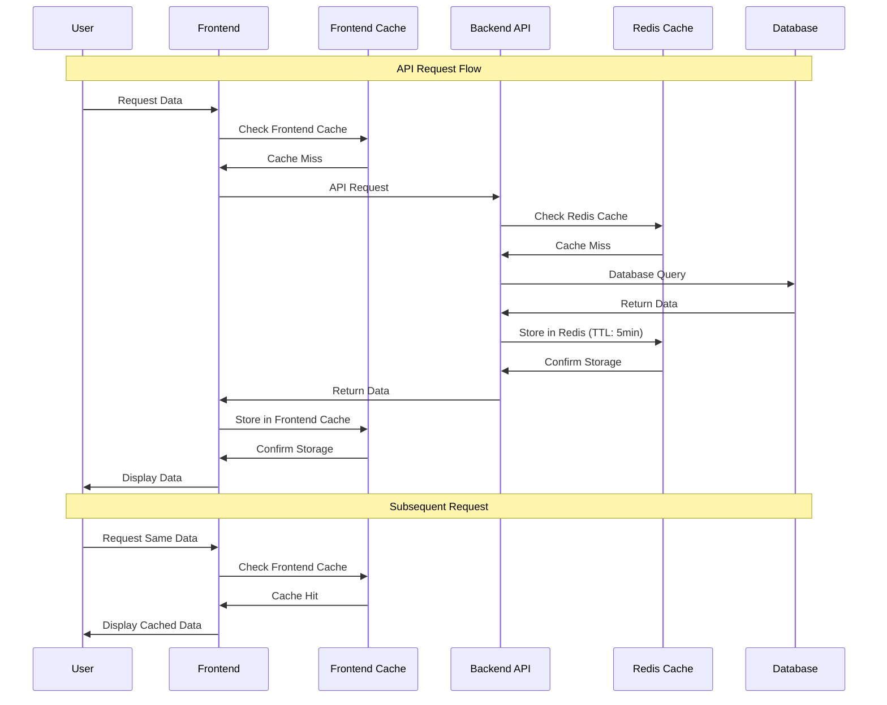

---

## 📊 **TRUST SCORE COMPONENT CALCULATION FLOW**

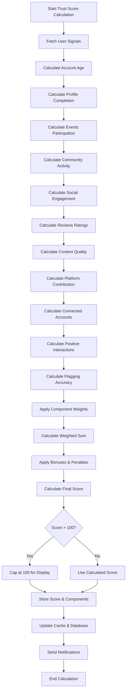

---

## 🔄 **DATA PERSISTENCE & BACKUP FLOW**

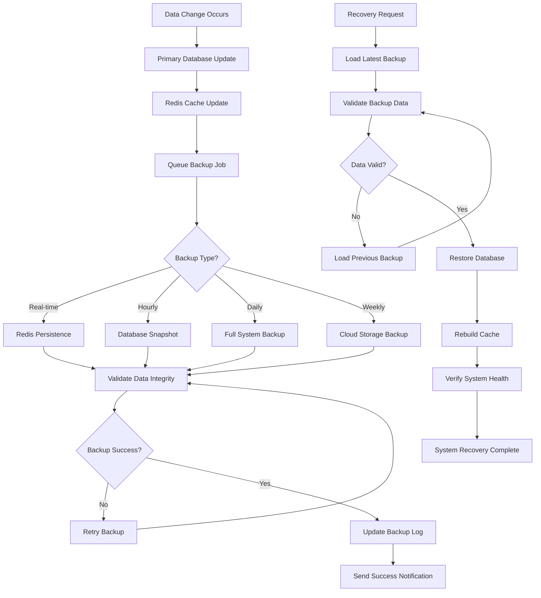

---

## 📈 **PERFORMANCE MONITORING FLOW**

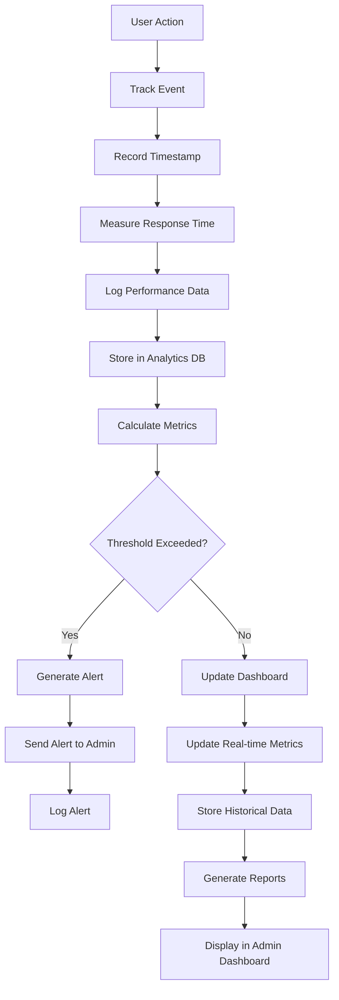

---

## 🚀 **DEPLOYMENT PIPELINE FLOW**

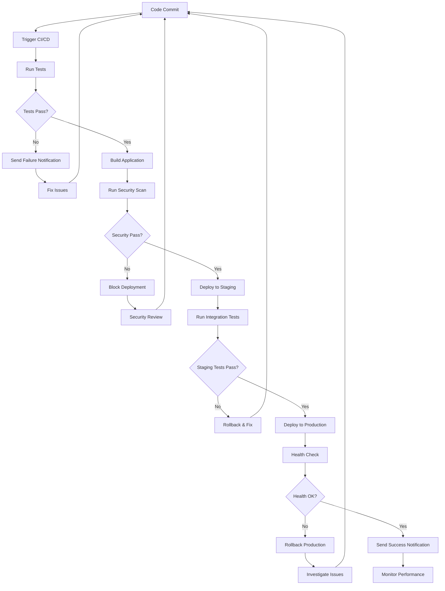

---

## 🔒 **SECURITY FLOW CHART**

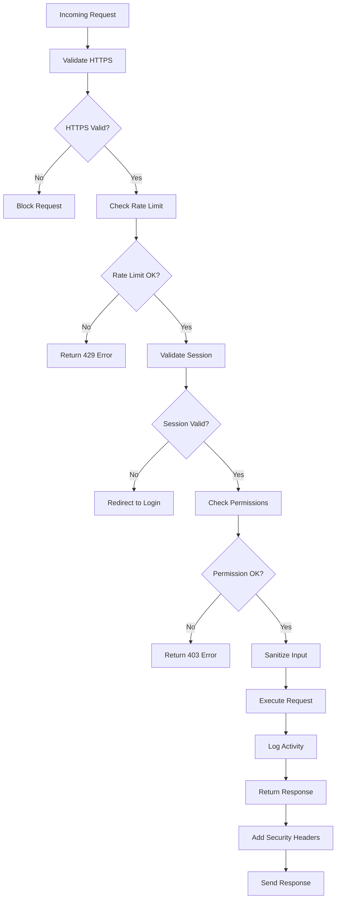

---

## 📱 **MOBILE RESPONSIVE FLOW**

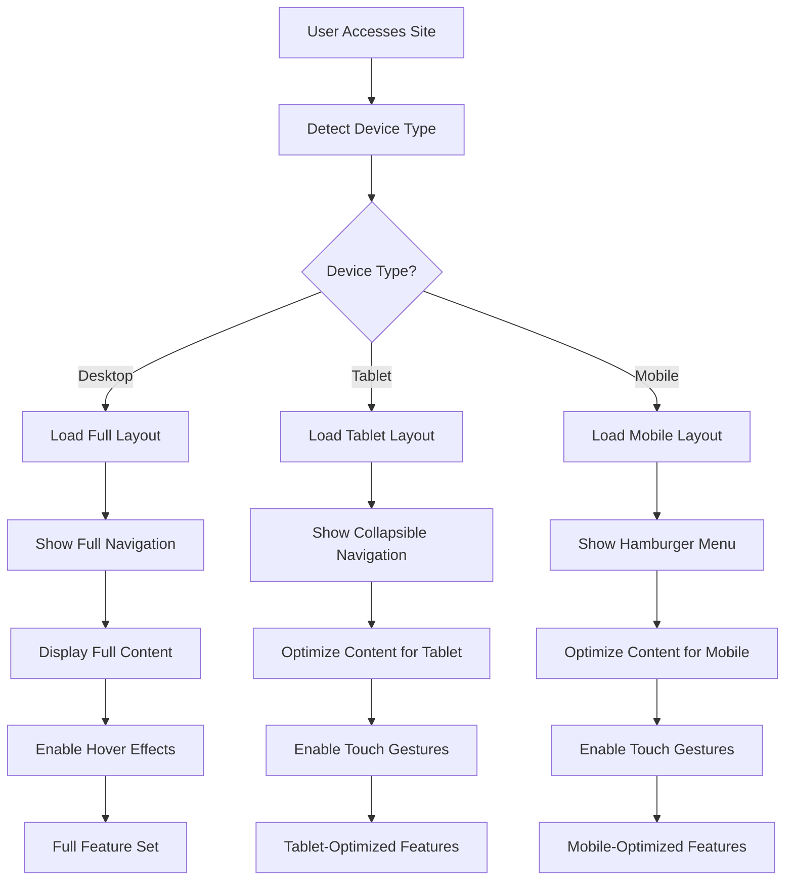

---

## 🔄 **REAL-TIME UPDATES FLOW**

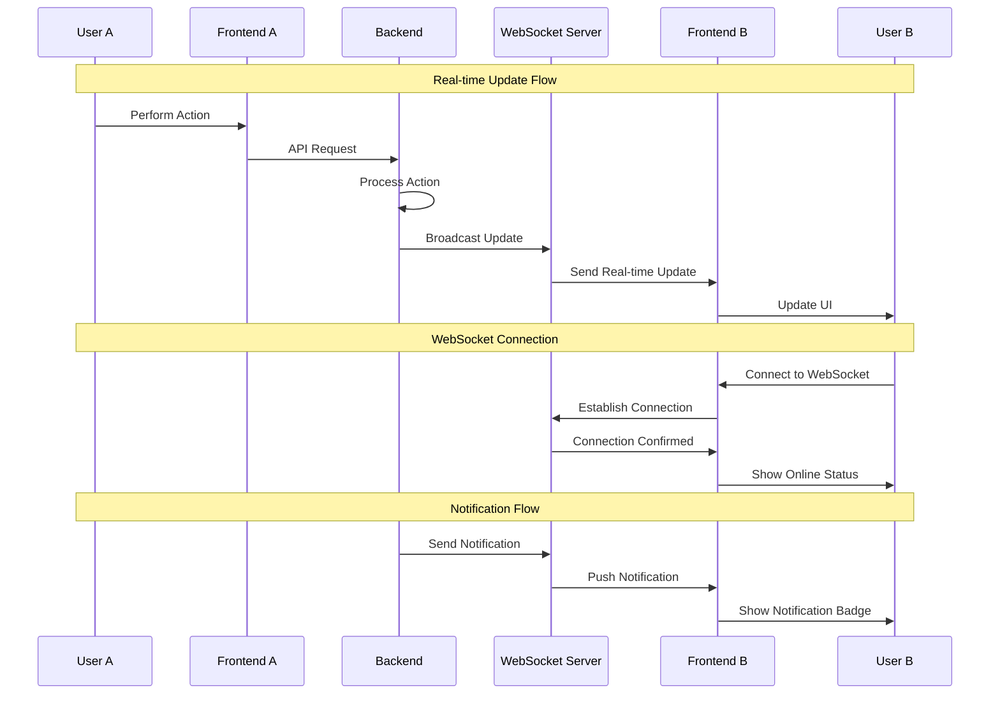

---

## 📊 **ANALYTICS DATA FLOW**

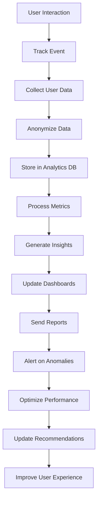

---

These flow charts and swim lane diagrams provide a comprehensive visual representation of how data flows through every aspect of the ScoopSocials platform, from user interactions to backend processing to data storage and real-time updates.
